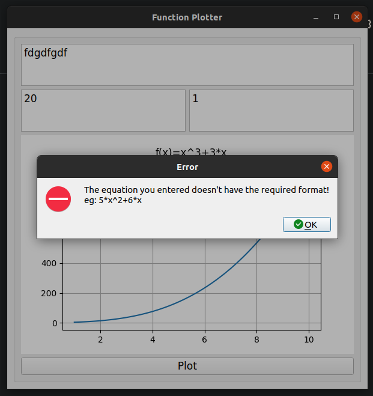
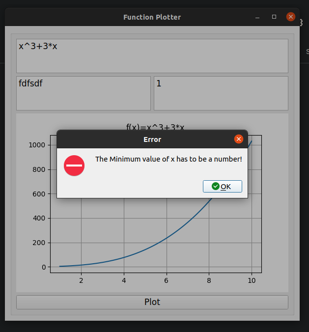

# Function-Plotter

## About The Task

> **Function-Plotterr** is a GUI program that plots a user-input function with a minimum and maximum x value. 

### Built with
- [python](https://www.python.org/)
- [Qt](https://doc.qt.io/qtforpython/)
- [pytest-qt](https://pytest-qt.readthedocs.io/en/latest/intro.html)


## Getting Started

> This is an list of needed instructions to set up your project locally, to get a local copy up and running follow these instructuins.

### Installation

1. **_Clone the repository_**

```sh
$ git clone git@github.com:GeekMind00/Function-Plotter.git
```

2. **_Navigate to repository directory_**

```sh
$ cd Function-Plotter
```

3. **_Install dependencies_**

```sh
$ pip install PySide2
$ pip install matplotlib
$ pip install numpy
```

### Running

1. **_Running the application_**

```sh
$ python plotter.py
```

2. **Running the tests**

```sh
$ cd testing-qt/tests
$ pytest test.py
```

### Desktop Screenshots

<div align="center">
  






</div>
  
